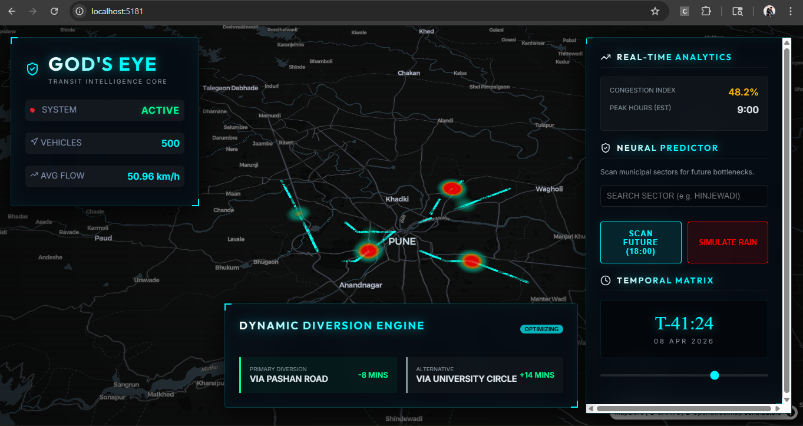

# 👁️ GOD'S EYE | TRANSIT INTELLIGENCE CORE

**Live Dashboard:** [trafficeye-pulse-matrix.onrender.com](https://trafficeye-pulse-matrix.onrender.com/)




# 🚦 Urban Traffic Flow & Congestion Prediction System

A data-driven urban intelligence system designed to analyze, predict, and visualize traffic congestion patterns in real time.

---

## 🚀 Problem

Urban areas face severe traffic congestion due to increasing vehicle density and lack of predictive infrastructure. Most systems react to traffic rather than anticipate it.

---

## 💡 Solution

This project uses **machine learning + data visualization** to predict congestion trends and present them through an interactive dashboard for better decision-making.

---

## 🧠 Key Features

* 📊 Traffic congestion prediction using ML models
* 🗺️ Visual dashboard for traffic flow analysis
* ⏱️ Time-based trend forecasting
* 📈 Data-driven insights for urban planning

---

## 🏗️ System Architecture

* **Frontend:** React dashboard
* **Backend:** Python (Flask / FastAPI)
* **ML Models:** Regression / time-series prediction
* **Data Processing:** Pandas, NumPy

---

## ⚙️ How It Works

1. Traffic data is collected (historical or simulated)
2. Data is cleaned and processed
3. ML model predicts congestion levels
4. Results are visualized on a dashboard

---

## 📊 Results

* Improved congestion prediction accuracy
* Ability to identify peak traffic hours
* Insight into traffic flow patterns

*(Add real metrics if possible — accuracy %, dataset size, etc.)*

---

## 🌍 Use Cases

* Smart city infrastructure
* Traffic management systems
* Urban planning and analysis
* Real-time congestion monitoring

---

## 🔮 Future Improvements

* Integration with live traffic APIs
* Real-time data streaming
* AI-based traffic signal optimization
* Geographic map integration

---

## 🌐 Demo

> (Add deployment link if available)

---

## 📦 Installation

```bash
git clone https://github.com/SOUMILCHANDRA/Urban-Traffic-Flow-Congestion-Prediction-System
cd Urban-Traffic-Flow-Congestion-Prediction-System
pip install -r requirements.txt
python app.py
```

---

## 👤 Author

Soumil Chandra
Full Stack & Data Visualization Engineer
